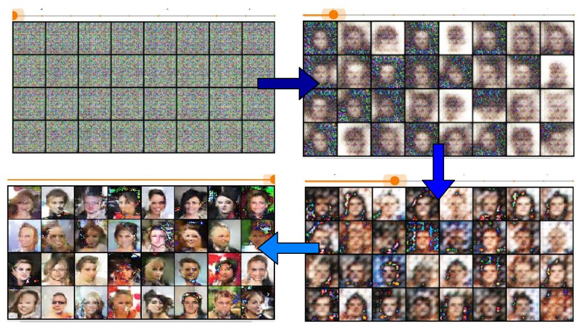

# Introduction-to-Deep-Convolutional-Generative-Adversarial-Networks-using-PyTorch
This repository contains my experience of using DCGAN (Deep Convolutional Generative Adversarial Networks) for face generation using "celebA" dataset and PyTorch on google-colaboratory platform.

Find the medium article 

